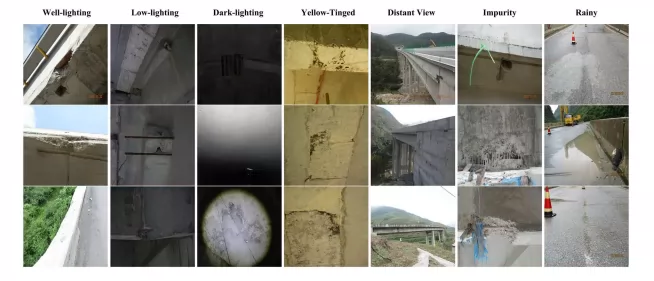
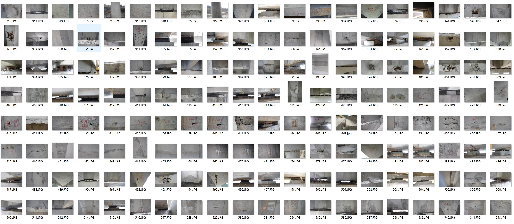
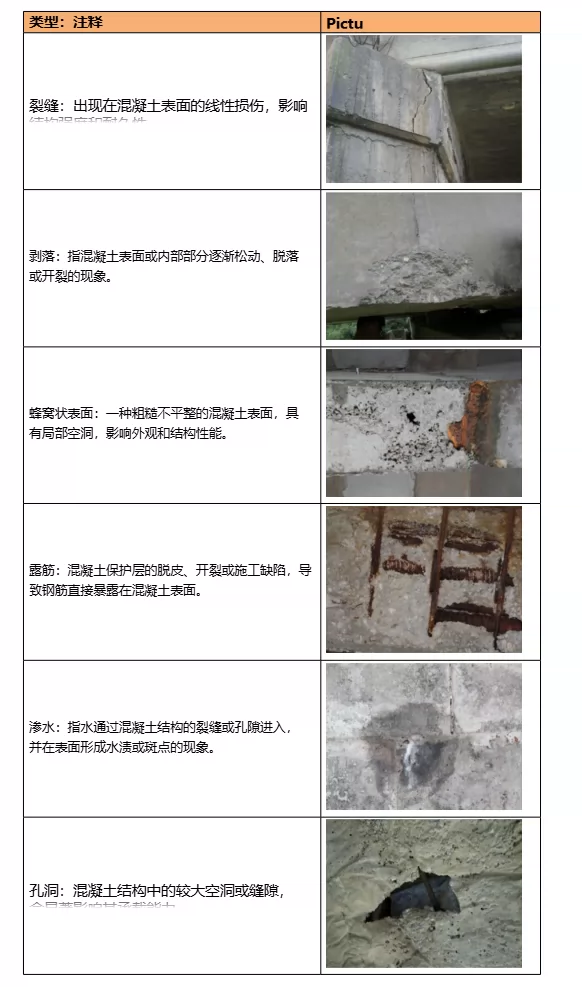
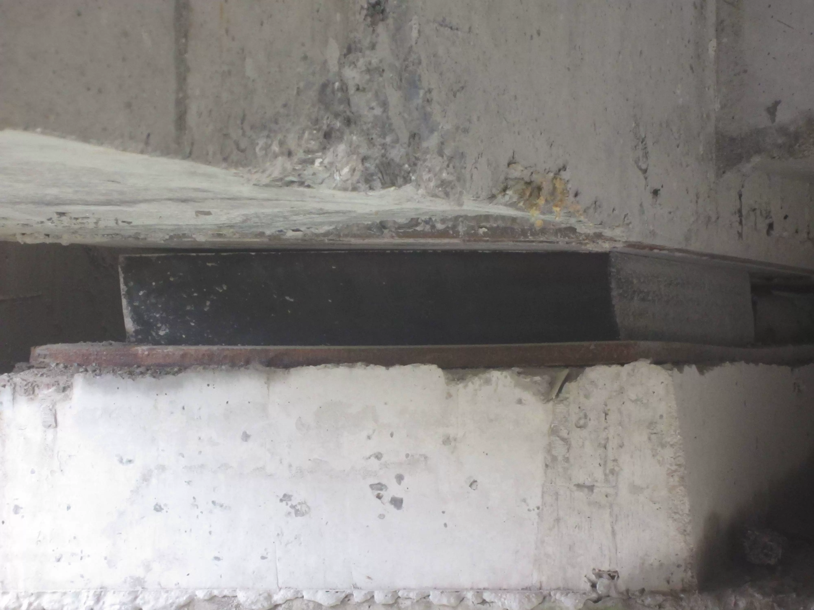
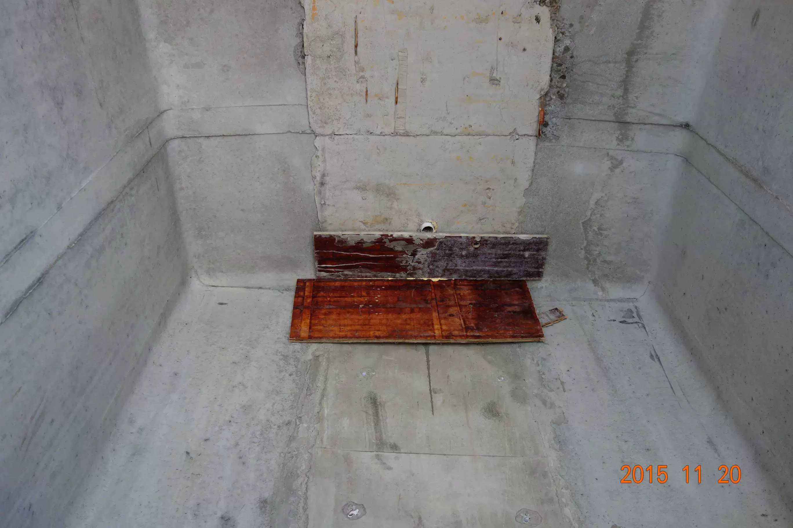
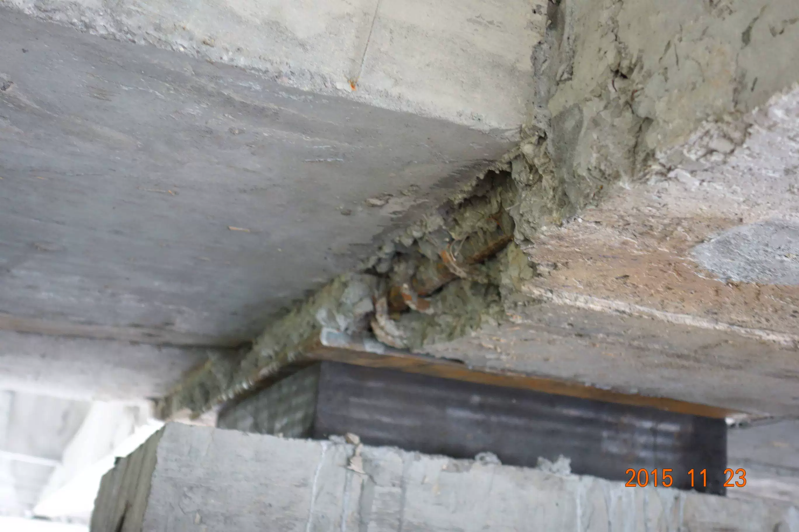
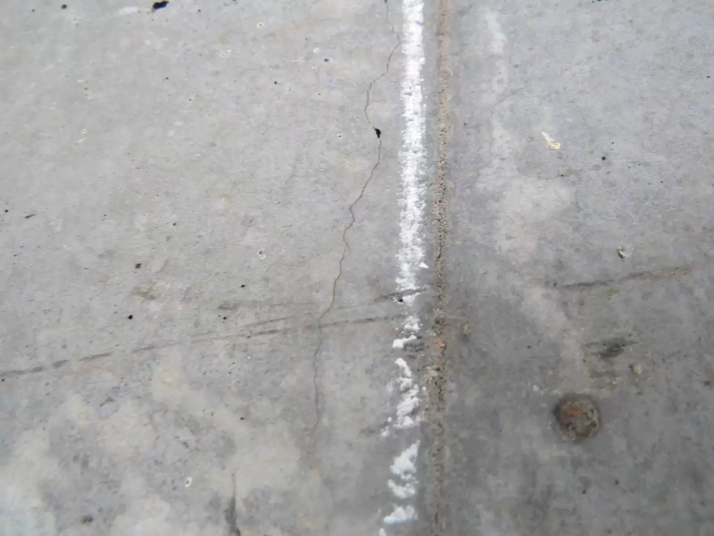

## Body

High-definition Bridge/Bridge Surface Defect Detection Dataset in YOLO format

A total of 11,123 high-resolution images (36G) are included, covering six types of defects: cracks, peeling, water seepage, honeycomb surface, exposed reinforcement, and holes. It covers various lighting and environmental conditions, comprehensively and realistically reflecting the diversity and complexity of bridge defects.

The dataset is divided into training, validation, and test subsets at a ratio of 8:1:1, stored in separate compressed files for each subset. Each compressed file contains two folders: one containing the original high-resolution images and another containing TXT annotation files specifying the location and category of each defect instance.

Data source article

Electronic virtual products sold without return or exchange.

## Images

Here is a pay link on Stripe ( https://buy.stripe.com/3cs8yP7sY87d0vu9AB ). Please contact me lonlonago@foxmail.com after funding $89, and I will send you a complete data files , thank you!

